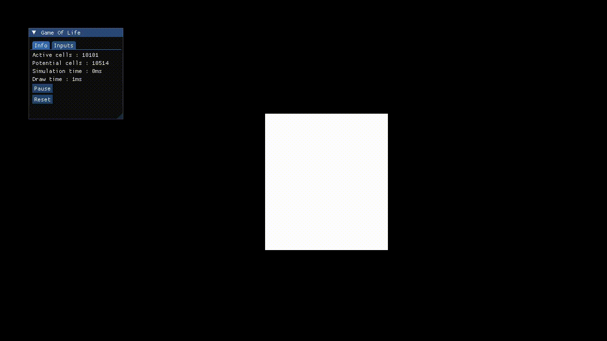

# SFML Conway's Game Of Life

## Description

Implementation of Conway's Game Of Life using C++, SFML and Sparse Encoding.

Based on [**Game Of Life Implementation**](https://www.youtube.com/watch?v=OqfHIujOvnE) by Javidx9.

## Example



## Controls

- WASD - ZQSD: Move Camera
- P: Toggle Pause
- R: Cleanup Scene
- O: Toggle Optimization
- LMB: Spawn one cell
- RMB: Spawn multiple cells
- Mouse Wheel: Zoom
- ESC: Close window

## Table of contents

- [SFML Conway's Game Of Life](#sfml-conways-game-of-life)
- [Description](#description)
- [Example](#example)
- [Controls](#controls)
- [Table of Contents](#table-of-contents)
- [Installation](#installation)
  - [Prerequisites](#prerequisites)
  - [Clone the repository](#clone-the-repository)
  - [Build the project](#build-the-project)
  - [Run the program](#run-the-program)
- [Libraries](#libraries)
- [License](#license)

## Installation

### Prerequisites

- C++ compiler (gcc, g++, cl, clang)
- CMake 3.28 or newer
- OpenMP

For Linux/Ubuntu, you also need to install the following dependencies:  

```bash
sudo apt-get update
sudo apt-get install -y libx11-dev \
                        libxcursor-dev \
                        libxi-dev \
                        libxrandr-dev \
                        libudev-dev \
                        libgl1-mesa-dev \
                        libfreetype6-dev \
                        libjpeg-dev \
                        libopenal-dev \
                        libflac-dev \
                        libvorbis-dev \
                        libxcb1-dev \
                        libxcb-image0-dev \
                        libxcb-randr0-dev \
                        libxcb-xtest0-dev
```

### Clone the repository

```bash
git clone https://github.com/Corentin-Mzr/GameOfLife-SFML.git
```

### Build the project

From the root folder, execute the following commands:

```bash
cmake -B build
cmake --build build
```

### Run the program

To run the program, launch it from the build/bin folder:

```bash
cd build/bin
./SFML-Conway.exe
```

## Libraries

The following libraries have been used for this program:

- [**SFML 3.0**](https://github.com/SFML/SFML)
- [**ImGui**](https://github.com/ocornut/imgui)

## License

This program is under the [**MIT License**](LICENSE.md)
